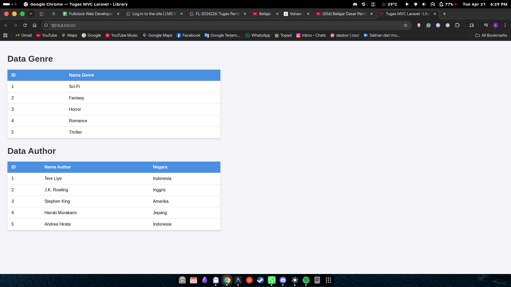

## Identitas Mahasiswa

- **Nama:** Muhammad Amir Al Aqwa
- **Kampus:** STT Terpadu Nurul Fikri
- **Semester:** 6

# Tugas Arsitektur MVC Laravel - Genre & Author

Repositori ini dibuat untuk memenuhi tugas mata kuliah/program SIB Fullstack Web Development. Fokus utama tugas ini adalah mengimplementasikan pola arsitektur **MVC (Model-View-Controller)** di Laravel tanpa menggunakan database (menggunakan static array pada Model).

## 📝 Deskripsi Tugas
Membuat sistem sederhana untuk menampilkan data Genre dan Author. Data diambil dari static array di dalam file Model, diproses melalui Controller, dan ditampilkan menggunakan View (Blade).

## 🚀 Fitur & Komponen
- **Models**: `Genre.php` dan `Author.php` (Menampung 5 data statis).
- **Controller**: `LibraryController.php` (Mengatur logika pengiriman data).
- **View**: `library.blade.php` (Menampilkan data dalam format tabel).
- **Routing**: Konfigurasi rute pada `web.php` untuk akses halaman utama.

## 📁 Struktur File Penting
- `app/Models/Genre.php`
- `app/Models/Author.php`
- `app/Http/Controllers/LibraryController.php`
- `resources/views/library.blade.php`
- `routes/web.php`

## 💻 Cara Menjalankan
1. Clone repositori ini:
   ```bash
   git clone https://github.com/Minkqwqw/Tugas-1-laravel.git
   ```
2. Jalankan server development Laravel:
   ```bash
   php artisan serve
   ```
3. Buka browser dan akses URL berikut:
   ```
   http://localhost:8000
   ```

## Preview Output

### Hasil Akhir


